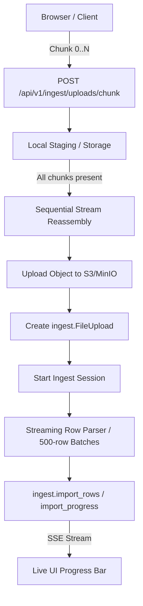

# Module: Ingest (Chunked Import & Streaming Pipeline)

## Overview & Scope (Plan V5 Phase 4)

The `ingest` module provides the robust backend and UI wizard for high-volume catalog onboarding and bulk updates (supporting files with 50,000+ items without memory spikes or connection timeouts).

---

## 1. Legacy Laravel Investigation & Architecture Parity (§4.1.1)

### Laravel Chunking Components
- **Client Transport (`ChunkUploadController.php`):**
  - Uses chunked HTTP multipart uploads.
  - Chunk identification: `file_uuid` (UUID string), `chunk_index` (0-based integer), `total_chunks` (integer), `filename` (string).
  - Storage location: Temporary chunks saved to `chunks/{file_uuid}/chunk_{chunk_index}`.
  - Reassembly: When `count(uploadedChunks) === total_chunks`, streams and concatenates files chunk-by-chunk using a 4KB buffer (`fread`/`fwrite`) directly to final storage, avoiding memory overhead.
  - Cleanup: Deletes the temporary `chunks/{file_uuid}` directory immediately following reassembly.
- **Spreadsheet Streaming (`ChunkReadFilter.php`):**
  - Implements PhpSpreadsheet `IReadFilter` (`$startRow`, `$chunkSize`).
  - Reads XLSX in fixed row windows (e.g. 500 rows) instead of loading the entire worksheet into RAM.

---

## 2. Go Chunked Pipeline Architecture

### 2.1 Chunked Upload Endpoints
- `POST /api/v1/ingest/uploads/chunk`:
  - Multipart form: `file` (chunk data), `chunk_index` (int), `total_chunks` (int), `file_uuid` (string), `filename` (string).
  - Stores chunk idempotently. Re-submitting the same chunk index is safe and overwrites without error.
  - When all chunks arrive, streams and uploads to S3/MinIO under tenant prefix `orgs/<orgID>/uploads/<file_uuid>.<ext>`.
  - Returns `{ "completed": true, "upload_id": 123, "public_id": "..." }`.
- `GET /api/v1/ingest/uploads/chunk/status?file_uuid=...`:
  - Returns list of received chunk indices `[0, 1, 2, ...]` to allow resuming an interrupted upload without re-sending completed chunks.

### 2.2 Streaming Spreadsheet Read
- For CSV: `encoding/csv.Reader` processes record-by-record with minimal memory footprint.
- For XLSX: Streaming row iterator (`excelize.Rows`) iterates row-by-row.
- Staged rows are inserted into `ingest.import_rows` in batches of 500 inside transactions.
- Progress updates are written to `ingest.import_progress` at each batch milestone, feeding the SSE event stream.

---

## 3. Server-Driven Wizard State Machine (§4.2)

The UI wizard strictly reflects the server session state:
- **Step 1 (Upload):** Dropzone with chunked transport. Creates `ingest.file_uploads` and `ingest.import_sessions` (`status = 'pending'`).
- **Step 2 (Mapping):** Automatic column detection via Phase 2 `DetectColumns`. User confirms or adjusts mappings (`POST /vendor/ingest/{id}/mapping`).
- **Step 3 (Review & Edit):** Server processes rows into `ingest.import_rows`. Paginated review table with inline editing of failed/unmatched items (`PUT /vendor/ingest/{id}/rows/{rid}`).
- **Step 4 (Commit):** Transactional commit into catalog inventory (`POST /vendor/ingest/{id}/commit`).
- **Resumability:** Accessing `/vendor/ingest/{sessionID}` loads the exact step corresponding to the session's database state.
