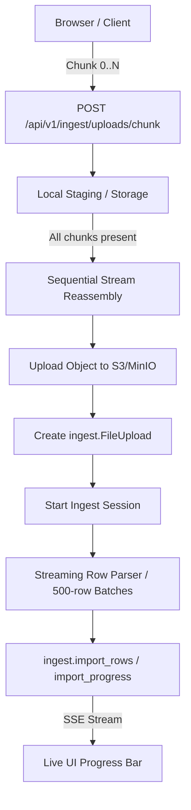

# Module: Ingest (Chunked Import & Streaming Pipeline)

## Overview & Scope (Plan V5 Phase 4)

The `ingest` module provides the robust backend and UI wizard for high-volume catalog onboarding and bulk updates (supporting files with 50,000+ items without memory spikes or connection timeouts).

---

## 1. Legacy Laravel Investigation & Architecture Parity (§4.1.1)

### Laravel Chunking Components
- **Client Transport (`ChunkUploadController.php`):**
  - Uses chunked HTTP multipart uploads.
  - Chunk identification: `file_uuid` (UUID string), `chunk_index` (0-based integer), `total_chunks` (integer), `filename` (string).
  - Storage location: Temporary chunks saved to `chunks/{file_uuid}/chunk_{chunk_index}`.
  - Reassembly: When `count(uploadedChunks) === total_chunks`, streams and concatenates files chunk-by-chunk using a 4KB buffer (`fread`/`fwrite`) directly to final storage, avoiding memory overhead.
  - Cleanup: Deletes the temporary `chunks/{file_uuid}` directory immediately following reassembly.
- **Spreadsheet Streaming (`ChunkReadFilter.php`):**
  - Implements PhpSpreadsheet `IReadFilter` (`$startRow`, `$chunkSize`).
  - Reads XLSX in fixed row windows (e.g. 500 rows) instead of loading the entire worksheet into RAM.

---

## 2. Go Chunked Pipeline Architecture

### 2.1 Chunked Upload Endpoints
- `POST /api/v1/ingest/uploads/chunk`:
  - Multipart form: `file` (chunk data), `chunk_index` (int), `total_chunks` (int), `file_uuid` (string), `filename` (string).
  - Stores chunk idempotently. Re-submitting the same chunk index is safe and overwrites without error.
  - When all chunks arrive, streams and uploads to S3/MinIO under tenant prefix `orgs/<orgID>/uploads/<file_uuid>.<ext>`.
  - Returns `{ "completed": true, "upload_id": 123, "public_id": "..." }`.
- `GET /api/v1/ingest/uploads/chunk/status?file_uuid=...`:
  - Returns list of received chunk indices `[0, 1, 2, ...]` to allow resuming an interrupted upload without re-sending completed chunks.

### 2.2 Streaming Spreadsheet Read
- For CSV: `encoding/csv.Reader` processes record-by-record with minimal memory footprint.
- For XLSX: Streaming row iterator (`excelize.Rows`) iterates row-by-row.
- Staged rows are inserted into `ingest.import_rows` in batches of 500 inside transactions.
- Progress updates are written to `ingest.import_progress` at each batch milestone, feeding the SSE event stream.

---

## 3. Server-Driven Wizard State Machine (§4.2)

The UI wizard strictly reflects the server session state:
- **Step 1 (Upload):** Dropzone with chunked transport. Creates `ingest.file_uploads` and `ingest.import_sessions` (`status = 'pending'`).
- **Step 2 (Mapping):** Automatic column detection via Phase 2 `DetectColumns`. User confirms or adjusts mappings (`POST /vendor/ingest/{id}/mapping`).
- **Step 3 (Review & Edit):** Server processes rows into `ingest.import_rows`. Paginated review table with inline editing of failed/unmatched items (`PUT /vendor/ingest/{id}/rows/{rid}`).
- **Step 4 (Commit):** Transactional commit into catalog inventory (`POST /vendor/ingest/{id}/commit`).
- **Resumability:** Accessing `/vendor/ingest/{sessionID}` loads the exact step corresponding to the session's database state.

---

## 4. AI Match Enhancement (vendor catalogue import)

The vendor import runs the **same** AI stage as the smart order pipeline: the same
system prompt (`aicapabilities.enhanceSystemPrompt`), the same rendered input, the
same response schema, and the same decision cache. There is one prompt to tune, and
answers are shared between the two features rather than bought twice.

### 4.1 Where it runs

`StageImport` → `stagingRun.enhance` (`internal/modules/ingest/catalog_stage.go`).
It runs **once, after the whole file has streamed**, never inside the row callback —
because everything that makes it cheap needs to see the whole file at once.

Only rows the deterministic engine left unsettled reach it. Rows the reader rejected
are excluded: they cannot be committed whatever the answer.

### 4.2 The four cost reductions, in the order they apply

1. **Duplicate collapse.** Rows sharing a normalised name become ONE question
   (`stagingRun.remember`). A price list naming a product in four warehouses asks once.
2. **Decision cache.** `catalog.match_decisions`, keyed by
   `sha256(norm_name ␟ sorted candidate ids ␟ prompt_version)` — byte-identical to the
   smart order's key. A remembered question is never sent
   (`Enhancement.applyCache`).
3. **Shared catalogue window.** Every candidate is de-duplicated into one CATALOG block
   the whole request references by id; items carry ids only, never repeated product rows
   (`Enhancement.plan`). A model may answer with any id in the window, which repairs the
   commonest retrieval failure: the right product was retrieved for a neighbouring row.
4. **Ceilings.** 200 items/request, 12 requests/run, 4 concurrent, 8-minute wall clock.
   A whole file is a handful of requests however long it is; past the ceiling rows keep
   their deterministic outcome and `AIStats.CeilingHit` says so on the review screen.

Retrieval (`Enhancement.Retrieve` → `productmatch.Recall`, limit 16) is a separate
recall-tuned pass, not the scorer's own shortlist — the scorer already failed on these
rows. It costs CPU only.

### 4.3 The three guards (`catalog_enhance_apply.go`)

Every answer is re-checked before it is applied, and each guard fails toward the
deterministic outcome:

1. **Window membership** — an id the model was not shown is a hallucination, rejected.
2. **Confidence floor** — `MinApplyConfidence = 0.80`; below it the answer is recorded
   as an abstention and the row keeps its deterministic outcome.
3. **`productmatch.IdentityConflict`** — strength, line-extension word (بلس/فورت/اكسترا…),
   dosage form and shared distinctive word re-checked against the catalogue's own record.

Accepted matches are written to the staged rows in **one** statement
(`Repository.ApplyAIMatches`) and recorded as `ai_confirmed` aliases — stored for an
operator to promote, deliberately excluded from the deterministic alias tier.

### 4.4 What the vendor sees

`ingest.catalog_imports.ai_stats` (migration 136) carries `AIStats`, rendered by
`aiPanel` on the review screen: how many rows improved, how many were answered from
memory at no cost, how many were sent, how many were left for manual review, and how
many requests the whole file needed. Rows the stage settled carry a 🤖 badge with the
model's own reason.

Failure is always silent and total: a Gateway outage, a spent budget or a malformed
response leaves a complete, deterministically matched staging table.
