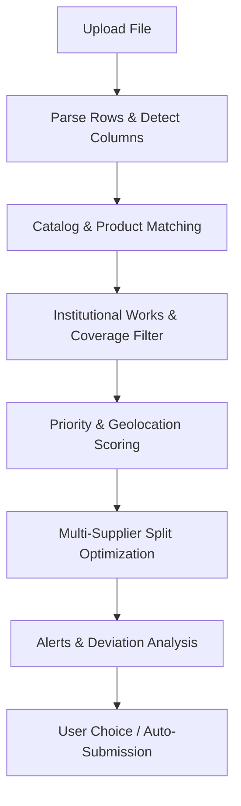

# Module: Workflow Automation (Automatic Purchase Request & Order Optimization)

## Overview & Scope (Plan V5 Phase 3 Task 3.3)

The Automatic Purchase Request capability enables pharmacies and institutional buyers to upload an inventory order list (Excel, CSV, or document) and automatically:
1. Detect and parse columns.
2. Match requested products against active supplier catalogs (`catalog.product_index`).
3. Apply institutional works access controls (`org.employee_institutional_works` Simple Mode 0).
4. Optimize vendor allocation based on price, discount, geographic distance, and supplier preference.
5. Generate alerts for price or stock deviations.
6. Submit purchase orders or multi-vendor purchase requests.

---

## 1. Input Specification

### Supported Formats
- Excel spreadsheets (`.xlsx`, `.xls`)
- Comma-separated values (`.csv`)
- Image/Document OCR fallback (`.jpg`, `.jpeg`, `.png`, `.pdf`) via Gateway capability `product.match` / OCR.

### Target Columns (`importTargetColumns`)
Reuses Phase 2 canonical column detection (`DetectColumns`):
- `product_name` (اسم المنتج / الصنف) — Required
- `sku` (رمز المنتج / كود الصنف) — Optional
- `barcode` (الباركود الدولي) — Optional
- `quantity` (الكمية المطلوبة) — Optional (defaults to 1 if unspecified)
- `alert_price` / `target_price` (سعر التنبيه / السعر المستهدف) — Optional
- `alert_discount` / `target_discount` (نسبة الخصم المستهدفة %) — Optional
- `notes` (ملاحظات الصيدلي) — Optional

---

## 2. Processing Pipeline Stages

### Stage 1: File Parsing & Column Detection
- Standard tabular parsing using Phase 2 column detection (`DetectColumns`).
- Header normalization with Arabic & English aliases.
- Non-standard/messy files fallback to AI extraction capability if deterministic mapping fails.

### Stage 2: Catalog Matching
- Matches each row against `catalog.product_index` with active products (`stock_quantity > 0`).
- Deterministic 6-strategy ladder:
  1. Exact SKU / Barcode match ($1.00$).
  2. Saved customer mapping match ($1.00$).
  3. Exact Arabic/English name match ($0.95$).
  4. Normalized name match without pharma noise ($0.85$).
  5. Scientific / active ingredient match ($0.75$).
  6. Fuzzy trigram similarity ($0.55 - 0.70$).
- AI Gateway capability `product.match` invoked only for confidence $< 0.55$.

### Stage 3: Access Control & Geolocation Filtering
- **Institutional Work Filter (Simple Mode 0):** `ARRAY_LENGTH(institutional_work_ids, 1) IS NULL OR institutional_work_ids && $authorizedWorkIDs`.
- **Geographic Distance Filter:** If `useLocation=true` (customer lat/lng provided), calculates distance in kilometers using `platform.distance_meters` / `CoverageService.ServesPoint`. Excludes branches beyond `maxDistance` (default $50\text{ km}$).
- Excludes the customer's own organization.

### Stage 4: Priority & Supplier Scoring
Applies Task 3.2 AI ranking formula to all candidate vendors for each matched line:
- Highest Discount weight ($0-30\text{ pts}$)
- Lowest Net Price weight ($0-30\text{ pts}$)
- Fastest Delivery / Shortest Distance ($0-25\text{ pts}$)
- Preferred Supplier Bonus ($0-15\text{ pts}$)

### Stage 5: Multi-Supplier Allocation Optimizer
For the full basket of requested products:
- Identifies if a single vendor can fulfill the entire basket.
- If multiple vendors are needed, executes combinatorial optimization to minimize the number of shipments while maximizing overall discount and minimizing total cost.
- Ensures vendor minimum order threshold (`min_order_price`) constraints are respected.

### Stage 6: Alerts & Deviation Checks
Checks each line against user-defined alert thresholds:
- Price alert: vendor final price $>$ `alert_price`.
- Discount alert: vendor discount $<$ `alert_discount`.
- Quantity alert: vendor stock $<$ `quantity`.

### Stage 7: Submission & User Choice
- If basket has 100% match rate with high confidence, optionally auto-submits or creates ready purchase orders.
- If partial matches or multiple competing split options exist, presents the User Choice Modal (`showUserChoiceModal`):
  - **Option A (Lowest Total Cost):** Split across suppliers offering lowest net price per item.
  - **Option B (Fastest Delivery):** Consolidate to closest suppliers within minimal radius.
  - **Option C (Minimal Vendor Count):** Consolidate to fewest possible suppliers to minimize shipment overhead.

---

## 3. Database Schema

### Table: `workflow.automation_requests`
- `id BIGINT GENERATED BY DEFAULT AS IDENTITY PRIMARY KEY`
- `public_id UUID NOT NULL DEFAULT gen_random_uuid()`
- `user_id BIGINT NOT NULL REFERENCES identity.users(id) ON DELETE CASCADE`
- `organization_id BIGINT REFERENCES org.organizations(id) ON DELETE CASCADE`
- `request_number TEXT NOT NULL UNIQUE` (Format: `AR-YYYYMMDD-XXX`)
- `original_filename TEXT`
- `status TEXT NOT NULL DEFAULT 'pending'` (`pending`, `processing`, `completed`, `failed`, `approved`)
- `total_products INT NOT NULL DEFAULT 0`
- `matched_products INT NOT NULL DEFAULT 0`
- `approved_products INT NOT NULL DEFAULT 0`
- `total_value NUMERIC(12,2) NOT NULL DEFAULT 0`
- `priorities JSONB NOT NULL DEFAULT '{}'::jsonb`
- `budget_constraint NUMERIC(12,2)`
- `file_data JSONB NOT NULL DEFAULT '[]'::jsonb`
- `vendor_matches JSONB NOT NULL DEFAULT '[]'::jsonb`
- `comparison_results JSONB NOT NULL DEFAULT '{}'::jsonb`
- `notes TEXT`
- `processed_at TIMESTAMPTZ`
- `approved_at TIMESTAMPTZ`
- `approved_by BIGINT REFERENCES identity.users(id) ON DELETE SET NULL`
- `created_at TIMESTAMPTZ NOT NULL DEFAULT now()`
- `updated_at TIMESTAMPTZ NOT NULL DEFAULT now()`

---

## 4. Web UI & API Endpoints

- `GET /customer/automation` — Automation upload wizard, priority configuration, and radius options.
- `POST /customer/automation/upload` — File upload endpoint (supports chunked transport).
- `GET /customer/automation/{id}` — Progress polling and analysis results view.
- `POST /customer/automation/{id}/choose` — User choice submission (Option A/B/C).
- `POST /customer/automation/{id}/submit` — Convert optimized allocation into orders or purchase requests.
- `GET /customer/automation/previous` — Historical automation requests history.

---

## 5. Architectural Reconciliation (Task 3.4: Order Optimization Services)

- **Legacy Laravel Scope:** In Laravel, `OrderOptimizationService`, `AutomatedOrderOptimizationService`, and `GeolocationSupplierOptimizer` were auxiliary service classes invoked exclusively by `AutomationRequest` / `ProcessAutomationFile` / `ProcessEnhancedAutomationJob` to group and rank candidate suppliers. There was no standalone `/customer/order-optimization` page.
- **Go Target Consolidation:** The entire optimization and multi-supplier partitioning logic is folded cleanly into `internal/modules/workflow/automation_optimize.go` (`OptimizeAllocations`), which produces three clear strategy proposals:
  1. **Option A (`lowest_cost`):** Pure lowest price per item minimizing overall expenditure.
  2. **Option B (`fastest_delivery`):** Geolocation proximity prioritizing fastest fulfillment windows.
  3. **Option C (`minimal_vendors`):** Dominant supplier consolidation minimizing separate delivery invoices and shipments.

